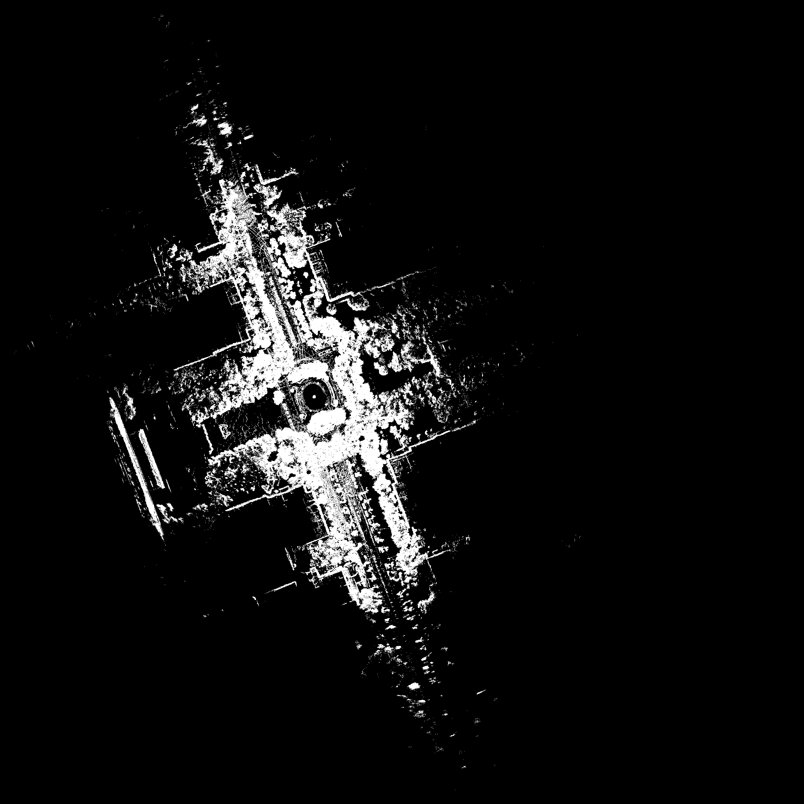

# ZJU Radar Dataset

## Download Link

[ZJU-Radar](https://zjuteducn-my.sharepoint.com/:f:/g/personal/201706120314_zjut_edu_cn/EmdoE4RvL-5Ppws83K1aSX8BaO4SBryLpSt1VGQ9DZI0tg?e=DXO2JQ)

## DataType

| Type  | Ros Topic Name  | Ros Topic Type          | Frequency(hz) |
| ----- | --------------- | ----------------------- | ------------- |
| Radar | /Navtech/Polar  | sensor_msgs/Image       | 4             |
| LiDAR | /rslidar_points | sensor_msgs/PointCloud2 | 10            |
| IMU   | /imu/data       | sensor_msgs/Imu         | 200           |
| RTK   | /gnss           | sensor_msgs/NavSatFix   | 4             |

## Parameter

ROLM extrinsics
lidar2gnss
[
1.0, 0.0, 0.0, 0.0,
0.0, 1.0, 0.0, 0.0,
0.0, 0.0, 1.0, -0.08,
0.0, 0.0, 0.0, 1.0
]
lidar2imu
[
1.0, 0.0, 0.0, 0.0,
0.0, 1.0, 0.0, -0.261,
0.0, 0.0, 1.0, 0.157,
0.0, 0.0, 0.0, 1.0
]
lidar2radar
[
1.0, 0.0, 0.0, 0.5745,
0.0, 1.0, 0.0, 0.0,
0.0, 0.0, 1.0, 0.0,
0.0, 0.0, 0.0, 1.0
]
lidar2camera
[
0.0, -1.0, 0.0, -0.214,
0.0, 0.0, -1.0, -0.157,
1.0, 0.0, 0.0, -0.02,
0.0, 0.0, 0.0, 1.0
]
camera2imu
[
0.0, 0.0, 1.0, 0.02,
-1.0, 0.0, 0.0, -0.475,
0.0, -1.0, 0.0, 0.0,
0.0, 0.0, 0.0, 1.0
]

## zjg-01

## zjg-02

## zjg-03

## zjg-04

## zjg-05

## zjg-06

## yq-01

## yq-02

## yq-03

## HUANGLONG

